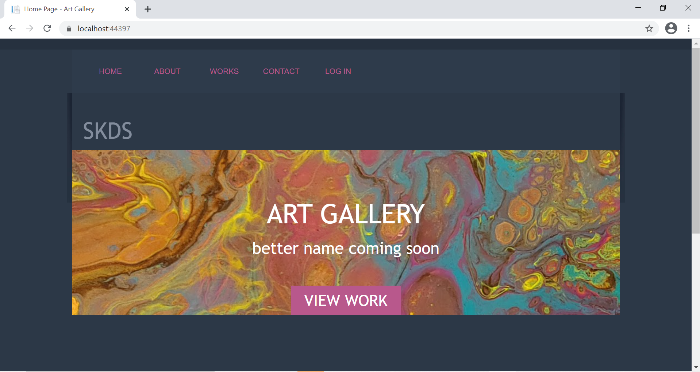
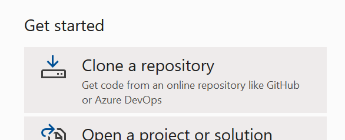

<!--
*** Thanks for checking out the Best-README-Template. If you have a suggestion
*** that would make this better, please fork the repo and create a pull request
*** or simply open an issue with the tag "enhancement".
*** Thanks again! Now go create something AMAZING! :D
***
***
***
*** To avoid retyping too much info. Do a search and replace for the following:
*** ntrpi, ArtGallery, twitter_handle, kupfer.sandra@gmail.com, ArtGallery, For this project we were encouraged to create an app about something we have a personal interest in. I started painting about 10 months ago and I have found that I love it. I created this app as a way to showcase my work, and eventually sell it. Both the app and painting are a work in progress.
-->


<!-- PROJECT SHIELDS -->
<!--
*** I'm using markdown "reference style" links for readability.
*** Reference links are enclosed in brackets [ ] instead of parentheses ( ).
*** See the bottom of this document for the declaration of the reference variables
*** for contributors-url, forks-url, etc. This is an optional, concise syntax you may use.
*** https://www.markdownguide.org/basic-syntax/#reference-style-links
-->
<!-- [![Contributors][contributors-shield]][contributors-url]
[![Forks][forks-shield]][forks-url]
[![Stargazers][stars-shield]][stars-url]
[![Issues][issues-shield]][issues-url]
[![MIT License][license-shield]][license-url]
[![LinkedIn][linkedin-shield]][linkedin-url] -->


<!-- PROJECT LOGO -->
<br />
<p align="center">
  <a href="https://github.com/ntrpi/ArtGallery">
    
  </a>

  <h3 align="center">HTTP5204 Passion Project - Art Gallery</h3>

  <p align="center">
    For this project we were encouraged to create an app about something we have a personal interest in. I started painting about 10 months ago and I have found that I love it. I created this app as a way to showcase my work, and eventually sell it. Both the app and painting are a work in progress.
    <br />
    <!-- <a href="https://github.com/ntrpi/ArtGallery"><strong>Explore the docs »</strong></a>
    <br /> -->
    <br />
    <a href="https://youtu.be/AgQ_Zoh6f8A">View Demo</a>
    ·
    <a href="https://github.com/ntrpi/ArtGallery/issues">Report Bug</a>
    ·
    <a href="https://github.com/ntrpi/ArtGallery/issues">Request Feature</a>
  </p>
</p>


<!-- TABLE OF CONTENTS -->
<details open="open">
  <summary><h2 style="display: inline-block">Table of Contents</h2></summary>
  <ol>
    <li>
      <a href="#about-the-project">About The Project</a>
      <ul>
        <li><a href="#built-with">Built With</a></li>
      </ul>
    </li>
    <li>
      <a href="#getting-started">Getting Started</a>
      <ul>
        <li><a href="#prerequisites">Prerequisites</a></li>
        <li><a href="#installation">Installation</a></li>
      </ul>
    </li>
    <li><a href="#usage">Usage</a></li>
    <li><a href="#roadmap">Roadmap</a></li>
    <li><a href="#contributing">Contributing</a></li>
    <li><a href="#license">License</a></li>
    <li><a href="#contact">Contact</a></li>
    <li><a href="#acknowledgements">Acknowledgements</a></li>
  </ol>
</details>


<!-- ABOUT THE PROJECT -->
## About The Project


[![Product Name Screen Shot][product-screenshot]] <!-- TODO: point to hosted site. (https://example.com) -->

<!-- Here's a blank template to get started:
**To avoid retyping too much info. Do a search and replace with your text editor for the following:**
`ntrpi`, `ArtGallery`, `twitter_handle`, `kupfer.sandra@gmail.com`, `ArtGallery`, `For this project we were encouraged to create an app about something we have a personal interest in. I started painting about 10 months ago and I have found that I love it. I created this app as a way to showcase my work, and eventually sell it. Both the app and painting are a work in progress.` -->

Gather 'round, children, and let me tell you the story of the web developer and the beast known as ASP.NET...

This is going to be a long story.

ASP.NET is huge, powerful, and dextrous beast, kind of like a kraken. Like a kraken, most of it is hidden, but you can really see and feel its effects. But ASP.NET is special kraken. Unlike the fearsome creature from the Pirates of the Carribean, this kraken is benevolent. It is kind, and desperately helpful. It not only wants to help build your app, but also to guide it and protect it as it sails the stormy seas of the internet. Like any creature, though, it has a personality. It is extremely intelligent, and believes it knows best. Not having the gift of speech, it struggles with communication at the best of times. And if you rub its scales the wrong way, it can be downright surly, refusing to tell you what you did wrong and determined to not let your app move forward even an inch until you figure out what you did wrong and apologize profusely.

My struggles with this project arose largely from my own lack of knowledge. I just haven't done enough studying to thoroughly understand the differences between the different project templates and their options, and the functionalities of the different NuGet packages and frameworks. There is just _so_ _much_ to learn, and with five other classes at the same time, not enough hours in the day. There are many tutorials available, but each one only works if you follow the steps exactly, although it is never revealed exactly why that is. As an analytical learner, this makes .NET difficult for me as the "how" only makes sense to me in the context of the "why".

The first iteration of this project died an early death because I tried to go by memory when I created the project, and didn't follow my the instructions precisely. I maybe wrote one class before I realized this kraken was going nowhere.

The second started much more optimistically because I knew I had created it correctly. I then enthusiastically coded all 17 of my models, including their dependencies, and then entered the command to add a migration with much satisfaction. Until it refused to create the database. Kraken out. File->New->Project...you know the drill.

I approached the third iteration with much more caution. I selected a single model, Form, that had two properties: an int ID, and a string name. I wrote the class, then trepiditiously entered the command to create the database. It cooperated, and successfully built a database with a single table. I was elated, but still cautious. I proceeded to create the data controller to interface with the database, one CRUD method at a time, testing each one carefully. Baiting the kraken with little bits of code, then waiting to see if it approved. When I was convinced it was working, I moved on to the web controller and cautiously created each CRUD method and its corresponding view, one at a time, testing again at each step, determined not to rock the boat. After a reasonable effort, it was finished, and it worked. The kraken and I had established a rapport.

Now that I had a successful model, I could add another one, Piece, slightly more complex and with a Form as a foreign key. Following the same process as the first, I slowly and carefully built up the access to this model step by step, and was again met with success. There was now some trust between the kraken and I.

For the third model, I chose something a bit more challenging: images. This one had to be thought though a bit more because although the CRUD is functionally the same, from a user perspective, an image in an art gallery only has value in the context of the piece it is of. Showing a list of images isn't really useful. Showing all the images for a given piece is. This also brought to light some other questions about showing the other models. I would need to be able to show details of a piece, but without at least one image the details lose value. Also, I would want to see all the pieces of a certain form, but only one image from each. So with the addition of this model came view models which combined the three main models and collections of models, and the views and controller methods to support them. And they worked! The kraken and I were now fast friends.

At this point, technically, I was done. I had completed the project requirements, which was to have CRUD functionality for up to three tables, which I had. The code was a bit messy, it needed comments and refactoring, but it worked, and the MVP wasn't due for another 4 days. So I could (wisely) spend the remaining time cleaning up my code, or...I could push the kraken.

Around this time, others in my class were really stuggling to get their MVPs. Many of them did not yet have CRUD for a single table, let alone more advanced features or model relationships. I had already spent many hours helping people with their projects, but there was one more thing I wanted to add to mine that several others were trying to add as well. So instead of code cleanup, I chose to add a new model, this one with a many-to-many relationship with the Piece model. I ended up doing this live on Discord, so that I could share my thought process and answer questions for my classmates that were having trouble with this. I didn't follow any examples for this, I just used the knowledge I had and my instincts as a developer. It took about three hours, but I am proud to say that I did successfully add the new model and have rudimentary CRUD working when I was done. I was tired, and the kraken needed a break, but I had done it.

I really should have stopped there. At this point the code _really_ needed comments and refactoring, and I needed to give more thought to the user stories. But I didn't. The kraken was just _so_ _strong_! I was so excited by my new functionality that I just started to code, not really having a single clear goal, just a pie-in-the-sky vision of my app being awesome. This was, not surprisingly, a big mistake. I'm not sure exactly what happened, but somewhere along the way I broke something and angered the kraken. A scale had been rubbed the wrong way. She turned her back on me, retreated to the darkest depths of my laptop, and wouldn't even move a single tentacle. It was less than 24 hours until the project was due, and I had nothing.

I had a few options. I could revert to an early version and pretend the adventure to Many-to-Many Island had never happened, and spend the rest of my time trying to clean things up. I could try to unravel my changes and discover exactly which scale I had scraped, hopefully retaining the new functionality, however messy it was. Or I could start fresh, create a new project, and try to port my code over. They each had advantages and disadvantages, but starting fresh had the best chance of producing the required functionality, and also having the code in a state that I would be comfortable to submit for review. It also afforded me the opportunity to take an iterative approach, where I could port over one model at a time. I liked my kraken, and I wanted her back. Since this had proven to be the most successful approach to coding for this project (and every other project, really), I chose to start fresh. File->New->Project...here we go again!

It took me about 10 hours of solid coding. I went deep, ignoring everyone and everything around me, determined to find my beloved kraken and coax her to sail with me again. I found her, and model by model, method by method, view by view, we worked together until I had rebuilt the CRUD functionality of the three main tables, Forms, Pieces, and Images. I refactored and simplified my code. I tested and retested. I didn't add comments, but I had precious few hours, and the code was clean and readable, with everything laid out simply and logically. I submitted it on time, and I was proud of what I had produced.

This project was a learning experience on so many different levels. Learning ASP.NET, like befriending any large and powerful beast, is a process that takes time and care. It will take much more reading, learning, and coding to make this relationship a strong and fruitful one. Working together with such a powerful creature, it's easy to see all the amazing things that can be accomplished with its strength. It's equally easy to let those possibilities cloud the reality that amazing things are more likely to be accomplished with clear goals and a solid plan in place. And lastly, that wrong turns are part of the process. You can lose sight of your goals for a time, but when you recognize that you have gotten off course, you can bear down and steer into the wind, and if you hold your course steady you will arrive at your destination, with a happy and loyal kraken at your side.

### Built With

* [ASP.NET](https://dotnet.microsoft.com/apps/aspnet)


<!-- GETTING STARTED -->
## Getting Started

To get a local copy up and running follow these simple steps.

### Prerequisites

You really only need one thing: Visual Studio. This app was built using Visual Studio 2019 Community, and I cannot guarantee that it will work with any other version.

### Installation

1. Clone the repo:
   ```sh
   git clone https://github.com/ntrpi/ArtGallery.git
   ```

   Or open VS and select "Clone a repository" from the "Getting started" menu:

    

  Enter the repository URL in the URL input field and clone.

2. Get the Entity Framework package:

  In the VS menu bar, go to Tools->NuGet Package Manager->Manage Nuget Packages for Solution. Install the Entity Framework package.

    <!--  -->

3. Build the database:

  In the VS menu bar, go to Tools->NuGet Package Manager->Package Manager Console. In the console, enter the following commands:
   ```sh
   enable-migrations
   ```
   ```sh
   add-migration ArtGallery_migration1
   ```
   ```sh
   update-database
   ```

<!-- USAGE EXAMPLES -->
## Usage

To run the app, press ctrl-F5 in VS. This will start the server and run the app. At this point, there are no restrictions on users, so anyone can create, read, update, and delete anything in the database. Have fun!


<!-- ROADMAP -->
## Roadmap

See the [open issues](https://github.com/ntrpi/ArtGallery/issues) for a list of proposed features (and known issues).


<!-- CONTRIBUTING -->
<!-- ## Contributing

Contributions are what make the open source community such an amazing place to be learn, inspire, and create. Any contributions you make are **greatly appreciated**.

1. Fork the Project
2. Create your Feature Branch (`git checkout -b feature/AmazingFeature`)
3. Commit your Changes (`git commit -m 'Add some AmazingFeature'`)
4. Push to the Branch (`git push origin feature/AmazingFeature`)
5. Open a Pull Request -->


<!-- LICENSE -->
<!-- ## License

Distributed under the MIT License. See `LICENSE` for more information. -->


<!-- CONTACT -->
## Contact

Sandra Kupfer - kupfer.sandra@gmail.com

Project Link: [https://github.com/ntrpi/ArtGallery](https://github.com/ntrpi/ArtGallery)


<!-- ACKNOWLEDGEMENTS -->
## Acknowledgements

* [Christine Bittle](https://github.com/christinebittle)
* [Othneil Drew and Doug Ayers](https://github.com/othneildrew/Best-README-Template)


<!-- MARKDOWN LINKS & IMAGES -->
<!-- https://www.markdownguide.org/basic-syntax/#reference-style-links -->
[contributors-shield]: https://img.shields.io/github/contributors/ntrpi/repo.svg?style=for-the-badge
[contributors-url]: https://github.com/ntrpi/repo/graphs/contributors
[forks-shield]: https://img.shields.io/github/forks/ntrpi/repo.svg?style=for-the-badge
[forks-url]: https://github.com/ntrpi/repo/network/members
[stars-shield]: https://img.shields.io/github/stars/ntrpi/repo.svg?style=for-the-badge
[stars-url]: https://github.com/ntrpi/repo/stargazers
[issues-shield]: https://img.shields.io/github/issues/ntrpi/repo.svg?style=for-the-badge
[issues-url]: https://github.com/ntrpi/repo/issues
[license-shield]: https://img.shields.io/github/license/ntrpi/repo.svg?style=for-the-badge
[license-url]: https://github.com/ntrpi/repo/blob/master/LICENSE.txt
[linkedin-shield]: https://img.shields.io/badge/-LinkedIn-black.svg?style=for-the-badge&logo=linkedin&colorB=555
[linkedin-url]: https://linkedin.com/in/ntrpi
[product-screenshot]: images/categoryView.png
